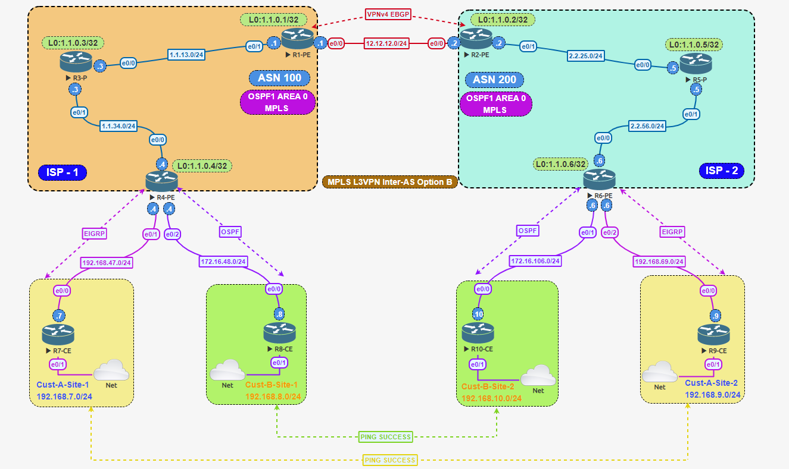

# Cisco MPLS L3VPN — Inter-AS Option B

**Author:** Naveed Shaikh  
**Portfolio:** https://naveedshaikh.de/Cisco-project1.html  

## Overview

This repository documents the MPLS L3VPN Inter-AS Option B design shown in my portfolio. Two provider networks, AS 100 and AS 200, connect two sites each for Customer A and Customer B. The diagram shows OSPF area 0 and MPLS in each provider core, VPNv4 eBGP between the border routers, EIGRP for Customer A access, and OSPF for Customer B access.

## Objectives

- Extend separate customer VPNs across two autonomous systems.
- Maintain Customer A and Customer B routing separation.
- Exchange labeled VPNv4 routes between provider border routers.
- Support different PE–CE routing protocols.
- Validate same-customer reachability and cross-customer isolation.

## Tasks and commands

Start with [the complete Tasks 1–4 guide](docs/tasks-and-commands.md). It covers basic addressing, OSPF/LDP, VRFs, VPNv4 BGP, EIGRP/OSPF PE–CE routing, redistribution and Option B. Complete files are in [configs](configs/README.md); verification is in [docs/validation.md](docs/validation.md).

The second provider uses AS 200, correcting the task text’s AS 102 typo. Option B border peering runs on R1/R2. CE VRF-lite is included because the tasks explicitly assign VRFs to the CE links.

## Device inventory

| Device | Role in the design | Provider AS | Loopback shown |
| --- | --- | --- | --- |
| R1-PE | Border router / ASBR | 100 | 1.1.0.1/32 |
| R3-P | Provider core router | 100 | 1.1.0.3/32 |
| R4-PE | Customer-facing PE | 100 | 1.1.0.4/32 |
| R2-PE | Border router / ASBR | 200 | 1.1.0.2/32 |
| R5-P | Provider core router | 200 | 1.1.0.5/32 |
| R6-PE | Customer-facing PE | 200 | 1.1.0.6/32 |
| R7-CE | Customer A, site 1 | Not specified | Not shown |
| R9-CE | Customer A, site 2 | Not specified | Not shown |
| R8-CE | Customer B, site 1 | Not specified | Not shown |
| R10-CE | Customer B, site 2 | Not specified | Not shown |

R1 and R2 retain the image's PE names, but their inter-provider function is ASBR. No route reflector is shown.

## Technology scope

MPLS, LDP, VRFs, route distinguishers, route targets, MP-BGP VPNv4, eBGP, iBGP, OSPF and EIGRP. LDP and VRF/route-target configuration are described on the portfolio page; VRF RD/RT values are now supplied in the tasks. Remaining lab choices are explicitly listed in the command guide.

## Limitations

The diagram uses public address ranges and AS numbers for its illustrative provider infrastructure. Recreate it only in an isolated lab, or redesign the addressing for your environment. No redundancy is shown. MPLS VPN separation does not itself encrypt customer traffic. Router images and third-party software are not included. No redistribution license has been selected for this package.

## References

- [Original portfolio project](https://naveedshaikh.de/Cisco-project1.html)
- [BGP/MPLS IP VPNs — RFC 4364, especially section 10](https://www.rfc-editor.org/rfc/rfc4364.html#section-10)
